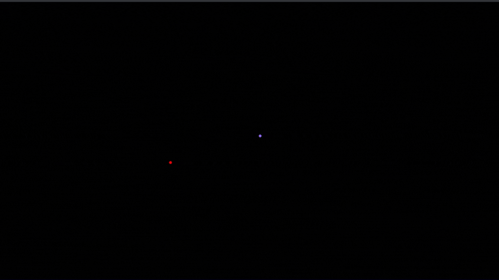

# Gravity

This program simulates the real-life gravity of massive objects.



## Executing

To use this program, you'll need a Python 3 virtual environment with the Pygame, Numpy and Pandas libraries.

```
python3 -m venv .venv
source .venv/bin/activate
pip3 install pygame numpy pandas
```

## Mathematical implementations

This program uses the Newtonian model of gravity.

Originally, Newton's formula for gravity was `-G*(m1*m2)/r²`, but we need to multiply that by the displacement vector to get the force vector. The formula for that is `(p1-p2)/r`. I simplified the formula to `-G*m1*m2*(p1-p2)/r³`, which appears on Wikipedia's page for [Newton's universal law of gravitation](https://en.wikipedia.org/wiki/Newton%27s_law_of_universal_gravitation#Vector_form). Finally, I simplified the m1 term with the mass that appears in the "force to acceleration" formula, also created by Newton (f/m=a), giving the following calculations: 

```python
f = 0
for object in objects_in_scene:
  f -= G * object.mass * (self.position - object.position) / distance(self.position, object.position)**3
  self.velocity = self.velocity + f
  self.position = self.position + self.velocity
```

This simulation was made using differential equations, which made the simulation less than completely realistic but able to simulate more than two objects (because humanity has not yet solved the three-body problem). However, it's realistic enough to be a cool project to show in a physics class.

If you want to see the energy lost during the simulation, you just need to set the constant SHOW_ENERGY_LOST at the start of the Python code to `True`.

## Cool observations

Initially, I thought there was a bug, but it's actually a cool fact about reference points. When using the center of the screen as the reference point, binary systems appeared to "shift" over time, which is different from what we learn in school and see in most videos on the internet, where both objects orbit the center of mass of the system. After some searching, I found that other Newtonian simulations on the internet exhibited the same "bug" that I had noticed. After testing, I discovered that the model we see in school uses the center of mass as the reference point. 

So I did the same, and the center of mass of the system is in the center of the screen, making the simulation look like the ones we usually watch.

> The only case in which the center of mass is not in the center of the screen is when there is only one object in the scene. This was designed to better illustrate the object's movement.

## Changing parameters

To change most of the parameters, you just need to change the `config.csv` file:

|Radius|X Position|Y Position|X Velocity|Y Velocity|Mass|Hex Color|Name|
|-|-|-|-|-|-|-|-|
|5|0|0|0|100000|6e+23|#00A5FF|Earth|

> You can add an Name to the objects, but the simulation can run properly without it.

To change the Window Size, the Scale of the screen and the Gravitational Constant, you need to change the constants `WINDOW_SIZE`, `ZOOM` and `GRAVITACIONAL_CONST` in the `gravity.py` file.
